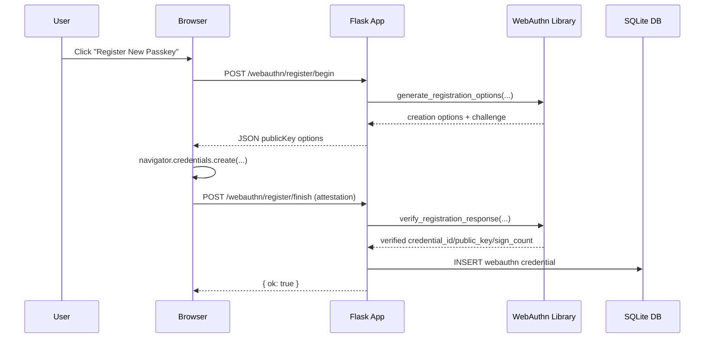
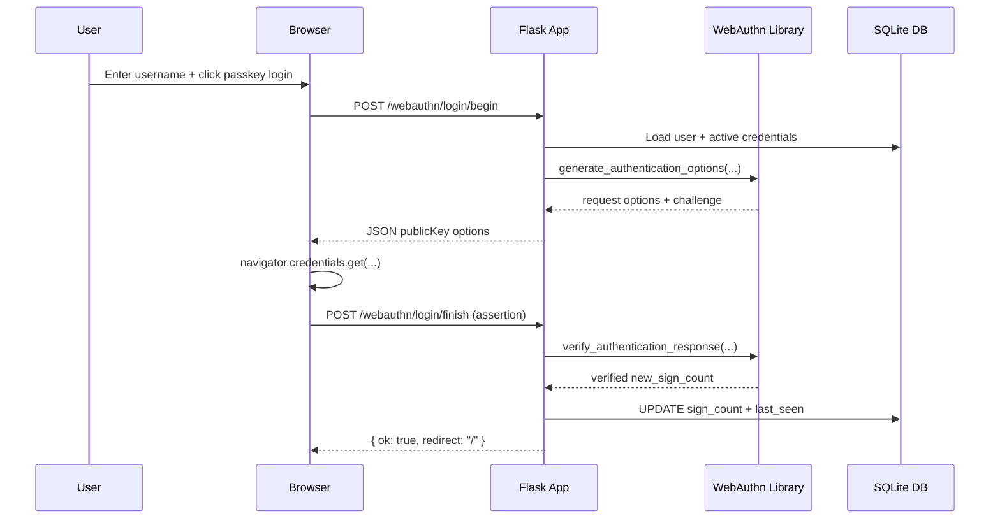

This post explains **how WebAuthn works** and how it is implemented in this demo application:
[isotopp/webauthn-demo](https://github.com/isotopp/webauthn-demo).

The target reader is a Python developer with Flask experience, but new to WebAuthn/passkeys.

## What WebAuthn Is (in one minute)

WebAuthn lets your application authenticate users with a public/private key credential (“passkey”) instead of only a password.

At a high level:
1. The server creates a one-time **challenge**.
2. The browser asks an authenticator (platform keychain, security key, etc.) to sign that challenge.
3. The server verifies the signed result against stored public key material.

Security-critical properties:
- Private keys never leave the authenticator.
- Challenges are one-time, anti-replay values.
- Verification is bound to RP ID/origin (`RP_ID`, `RP_ORIGIN`).

In this app, that policy is configured in:
- [`src/webauthn_test/config.py`](https://github.com/isotopp/webauthn-demo/blob/main/src/webauthn_test/config.py)

## Where the WebAuthn implementation lives

Core files:
- HTTP flow and session challenge handling:
  [`src/webauthn_test/routes.py`](https://github.com/isotopp/webauthn-demo/blob/main/src/webauthn_test/routes.py)
- WebAuthn library adapter (options/verify calls, bytes/base64url conversions):
  [`src/webauthn_test/webauthn_service.py`](https://github.com/isotopp/webauthn-demo/blob/main/src/webauthn_test/webauthn_service.py)
- Credential persistence model (`WebAuthn`, aliased as `Authenticator`):
  [`src/webauthn_test/models.py`](https://github.com/isotopp/webauthn-demo/blob/main/src/webauthn_test/models.py)
- Browser-side ceremony JS:
  - [`src/webauthn_test/templates/user_defaults.html`](https://github.com/isotopp/webauthn-demo/blob/main/src/webauthn_test/templates/user_defaults.html) (registration)
  - [`src/webauthn_test/templates/index.html`](https://github.com/isotopp/webauthn-demo/blob/main/src/webauthn_test/templates/index.html) (login)

Also useful:
- test strategy explainer:
  [`tests/README.md`](https://github.com/isotopp/webauthn-demo/blob/main/tests/README.md)
- endpoint/infrastructure overview:
  [`README.md`](https://github.com/isotopp/webauthn-demo/blob/main/README.md)

## User-visible flow and internal handling

## What the user sees (and what the system does)

This section is intentionally experience-first: what a user sees on macOS in
Firefox with Bitwarden available as a passkey provider, and what happens in the
browser/app internals behind each visible step.

### Signup

What the user sees:
1. User opens `/auth/register`.
2. User enters email, username, and password.
3. User submits and lands in an authenticated flow (`/user/defaults` by default).

What the browser and app do:
1. Browser submits an HTML form to Flask-Security register route (`/auth/register`).
2. Flask-Security validates inputs, hashes password, creates user record.
3. App session is established and response redirects to the configured post-register view.

Relevant code:
- [`src/webauthn_test/forms.py`](https://github.com/isotopp/webauthn-demo/blob/main/src/webauthn_test/forms.py)
- [`src/webauthn_test/app.py`](https://github.com/isotopp/webauthn-demo/blob/main/src/webauthn_test/app.py)
- [`src/webauthn_test/models.py`](https://github.com/isotopp/webauthn-demo/blob/main/src/webauthn_test/models.py)

### Login (password and passkey)

What the user sees (password):
1. User opens `/auth/login`.
2. User enters email + password.
3. User is redirected to `/` and sees `hello, {username}`.

What the browser and app do (password):
1. Browser posts form data to Flask-Security login route.
2. Flask-Security verifies password hash and updates login state.
3. App logs activity and renders authenticated UI.

What the user sees (passkey on macOS/Firefox/Bitwarden):
1. User opens `/`.
2. User enters username and clicks **Sign in with Passkey**.
3. Firefox opens the WebAuthn prompt; available authenticators/providers are shown.
   Depending on local setup, this can involve:
   - platform flow (macOS local authenticator / Touch ID path), and/or
   - Bitwarden passkey flow if Bitwarden is configured as a credential provider.
4. User approves with biometrics/PIN/master-unlock path.
5. User returns to app and sees `hello, {username}`.

What the browser and app do (passkey):
1. Browser `fetch`es `POST /webauthn/login/begin` with username.
2. Server creates assertion options + challenge and stores challenge in session.
3. Browser executes `navigator.credentials.get({ publicKey })`.
4. Browser posts assertion to `POST /webauthn/login/finish`.
5. Server verifies assertion, updates sign count and last-seen state, then logs user in.

Relevant code:
- [`src/webauthn_test/templates/index.html`](https://github.com/isotopp/webauthn-demo/blob/main/src/webauthn_test/templates/index.html)
- [`src/webauthn_test/routes.py`](https://github.com/isotopp/webauthn-demo/blob/main/src/webauthn_test/routes.py)
- [`src/webauthn_test/webauthn_service.py`](https://github.com/isotopp/webauthn-demo/blob/main/src/webauthn_test/webauthn_service.py)

### Account deletion

What the user sees:
1. User opens `/user/defaults`.
2. User clicks **Delete My Account** and confirms.
3. User is logged out and returned to `/`.

What the browser and app do:
1. Browser submits form action `delete_account` to `/user/defaults`.
2. Server logs `account_deleted`, clears related credential records, removes the user.
3. Session is ended (`logout_user()`), and client is redirected to index page.

Relevant code:
- [`src/webauthn_test/templates/user_defaults.html`](https://github.com/isotopp/webauthn-demo/blob/main/src/webauthn_test/templates/user_defaults.html)
- [`src/webauthn_test/routes.py`](https://github.com/isotopp/webauthn-demo/blob/main/src/webauthn_test/routes.py)

### A. Password signup/login (before passkeys)

User-visible flow:
1. Register at `/auth/register`.
2. Log in at `/auth/login`.
3. Open `/user/defaults`.

Internal handling:
- Flask-Security handles account registration/login/password reset.
- The app stores user profile fields and activity events.
- User state and role model are defined in
  [`src/webauthn_test/models.py`](https://github.com/isotopp/webauthn-demo/blob/main/src/webauthn_test/models.py).

### B. Passkey registration (user already logged in)

User-visible flow:
1. User clicks **Register New Passkey** on `/user/defaults`.
2. Browser prompts for platform authenticator/security key.
3. On success, page reloads and passkey appears in the credential list.

Internal step-by-step:
1. Browser calls `POST /webauthn/register/begin`.
2. Server builds PublicKeyCredentialCreationOptions via
   `begin_registration(...)` in
   [`src/webauthn_test/webauthn_service.py`](https://github.com/isotopp/webauthn-demo/blob/main/src/webauthn_test/webauthn_service.py).
3. Server stores challenge in session (`webauthn_register_challenge`).
4. Browser runs `navigator.credentials.create({ publicKey })`.
5. Browser posts attestation payload to `POST /webauthn/register/finish`.
6. Server verifies attestation via `finish_registration(...)` and persists credential in `WebAuthn` table.

Mermaid sequence:

### C. Passkey login

User-visible flow:
1. User opens `/`.
2. Enters username in **Passkey Login**.
3. Clicks **Sign in with Passkey**.
4. Browser authenticator prompt appears.
5. On success user lands on `hello, {username}`.

Internal step-by-step:
1. Browser calls `POST /webauthn/login/begin` with username.
2. Server loads user and active credentials for current `credential_version`.
3. Server creates assertion options (`generate_authentication_options`).
4. Server stores login challenge in session (`webauthn_login_challenge`).
5. Browser runs `navigator.credentials.get({ publicKey })`.
6. Browser sends assertion to `POST /webauthn/login/finish`.
7. Server verifies assertion (`verify_authentication_response`).
8. Server updates sign counter and last-used timestamp, then logs user in.

Mermaid sequence:

## Why `credential_version` exists

This app has a user-visible action to “regenerate credentials” (actually a version rotation).

When the user increments `credential_version`:
- Existing passkeys are not physically deleted immediately.
- Login begin/finish only considers credentials matching current version.
- Old passkeys become effectively inactive.

This gives predictable invalidation semantics while keeping auditability.

Implementation references:
- versioned filtering in routes:
  [`src/webauthn_test/routes.py`](https://github.com/isotopp/webauthn-demo/blob/main/src/webauthn_test/routes.py)
- credential model field:
  [`src/webauthn_test/models.py`](https://github.com/isotopp/webauthn-demo/blob/main/src/webauthn_test/models.py)

## RP ID / Origin correctness (critical)

WebAuthn verification will fail if RP settings do not match real deployment origin.

For this demo:
- set canonical URL in `.env` as `RP_ORIGIN`
- derive `RP_ID` from that host
- run behind TLS-terminating Apache with proper proxy headers

See deployment and config details:
- [`README.md`](https://github.com/isotopp/webauthn-demo/blob/main/README.md)
- [`deploy/rocky9/README.md`](https://github.com/isotopp/webauthn-demo/blob/main/deploy/rocky9/README.md)

## Testing approach for this flow

Relevant tests include:
- WebAuthn registration/login endpoint tests:
  [`tests/test_webauthn_endpoints.py`](https://github.com/isotopp/webauthn-demo/blob/main/tests/test_webauthn_endpoints.py)
- Auth/account/admin mutation tests:
  [`tests/test_auth_flows.py`](https://github.com/isotopp/webauthn-demo/blob/main/tests/test_auth_flows.py),
  [`tests/test_user_and_admin_routes.py`](https://github.com/isotopp/webauthn-demo/blob/main/tests/test_user_and_admin_routes.py)

And the rationale for what is intentionally not tested (because brittle/low-value) is documented in:
- [`tests/README.md`](https://github.com/isotopp/webauthn-demo/blob/main/tests/README.md)

## Practical takeaway

If you already know Flask, the core WebAuthn implementation pattern is:
1. create challenge + options (`begin` endpoint),
2. store challenge server-side (session),
3. verify browser credential (`finish` endpoint),
4. persist credential/sign counter,
5. enforce RP origin and credential version semantics consistently.

That is exactly how this demo is structured in the linked code.

## Glossary

- **WebAuthn**: The W3C API/protocol for public-key web authentication.  
  Docs: [W3C WebAuthn Level 3](https://www.w3.org/TR/webauthn-3/), [MDN Web Authentication API](https://developer.mozilla.org/en-US/docs/Web/API/Web_Authentication_API)
- **Passkey**: User-facing term for a WebAuthn credential (public/private key pair managed by an authenticator).  
  Docs: [passkeys.dev](https://passkeys.dev/)
- **Relying Party (RP)**: Your app/service requesting authentication.  
  Example in this project: RP is the site at `https://webauthn.home.koehntopp.de`.
- **RP ID**: Domain identifier that credentials/assertions are bound to.  
  Example: `RP_ID=webauthn.home.koehntopp.de`
- **Origin**: Full web origin (`scheme://host[:port]`) verified during ceremonies.  
  Example: `RP_ORIGIN=https://webauthn.home.koehntopp.de`
- **Authenticator**: Component creating/using private keys (platform keychain or roaming security key).  
  Docs: [WebAuthn authenticators model](https://www.w3.org/TR/webauthn-3/#authenticator-model)
- **Attestation**: Registration-time proof package used when creating a credential record.  
  Docs: [Attestation statement format](https://www.w3.org/TR/webauthn-3/#attestation-object)
- **Assertion**: Login-time signed response proving possession of an existing credential.  
  Docs: [Authentication assertion](https://www.w3.org/TR/webauthn-3/#sctn-verifying-assertion)
- **Challenge**: One-time random server value preventing replay.  
  Example shape: base64url string such as `m8N3Q0fY...` (stored server-side in session and verified on finish).
- **Credential ID**: Opaque identifier for one credential, used to look up stored key material.  
  Example shape: base64url like `AczX3k9...`; in this app it is stored in DB as bytes and rendered as base64url for display.
- **Public Key**: Server-stored key used to verify assertions; private key remains in authenticator.  
  Docs: [Public key credential source](https://www.w3.org/TR/webauthn-3/#credential-public-key)
- **Sign Count**: Monotonic counter used to detect suspicious credential replay/cloning patterns.  
  Docs: [Signature counter considerations](https://www.w3.org/TR/webauthn-3/#sign-counter)
- **User Verification (UV)**: Authenticator-level check (biometric/PIN) before signing.  
  Docs: [User verification requirement](https://www.w3.org/TR/webauthn-3/#enum-userVerificationRequirement)
- **Resident/Discoverable Credential**: Credential discoverable by authenticator without server-supplied credential IDs.  
  Docs: [Client-side discoverable credentials](https://www.w3.org/TR/webauthn-3/#client-side-discoverable-public-key-credential-source)
- **Transports**: Hints describing authenticator connectivity.  
  Example values: `internal`, `usb`, `nfc`, `ble`, `hybrid`  
  Docs: [Authenticator transport values](https://www.w3.org/TR/webauthn-3/#enumdef-authenticatortransport)
